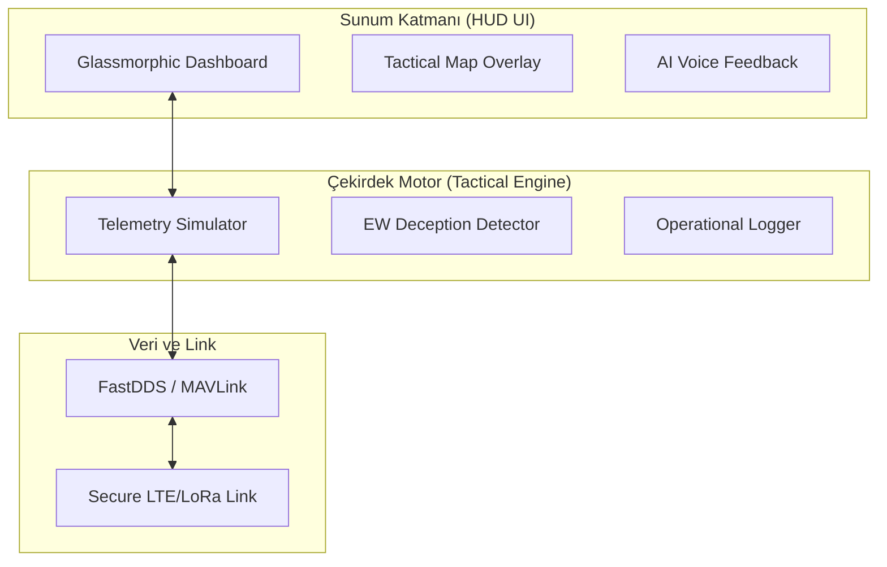

# 🦅 SUNGUR Misyon Kontrol: Taktik Komuta Merkezi `v3.0-SUNGUR`

[](https://github.com/arch-yunus/uav-mission-control)
[](https://github.com/arch-yunus/uav-mission-control)
[](https://github.com/arch-yunus/uav-mission-control)

> **"Görmek hakimiyetin ilk adımı, senkronizasyon ise ikincisidir."**

**SUNGUR Taktik Merkezi**'ne hoş geldiniz—yüksek performanslı İHA operasyonları için nihai komuta ve kontrol arayüzü. Bu sistem, sadece veriyi görselleştirmekle kalmaz, karmaşık çoklu İHA ekosistemlerini tek bir "SUNGUR" (Egemen) zekâ altında birleştirir.

---

## 🛰️ HUD Felsefesi: *Siber-Asabiyet*

SUNGUR HUD, bir gösterge panelinden öte, operatörün dijital sinir sistemi olarak kurgulanmıştır. **Glassmorphism** estetiği ve **3D Perspektif Katmanları** ile inşa edilen v3.0 arayüzü, siber dünyanın disiplini ile sahanın fiziksel gerçekliğini harmanlar.

### 💎 v3.0-Sovereign Mimari Yenilikler

| Özellik | Teknik Altyapı | Operasyonel Çıktı |
| :--- | :--- | :--- |
| **Sesli Sentez (VUI)** | Web Speech & Voice Engine | Eller serbest durum raporlaması ve sesli uyarılar. |
| **3D Perspektif HUD** | CSS Grid & Perspective Logic | Derinlikli panel yapısı ile odaklanmış veri takibi. |
| **EH Spektrum Analizörü** | Canvas API & Real-time FFT | Karıştırma (Jamming) ve yanıltma girişimlerini anlık teşhis. |
| **Yapay Ufuk (Horizon)** | 3D Transform & Gyro Data | Pürüzsüz pitch/roll görselleştirmesi ile anlık stabilite kontrolü. |

---

## 🛠️ Teknik Yığın ve Mimari Derinlik

Sistemin kalbi, asenkron veri işleme ve düşük gecikmeli görselleştirme üzerine kurulu **Tactical Engine v3.0** motorudur.



### 🧠 Tactical Engine v3.0 Özellikleri
- **Asenkron Veri Boru Hattı**: Telemetri verilerini milisaniye hassasiyetinde işleyen event-driven yapı.
- **Dinamik EH Algılama**: Gelen sinyaldeki anormallikleri analiz ederek operatöre "Spoofing" veya "Jamming" uyarısı gönderen algoritmalar.
- **Sesli Durum Bildirimi**: Kritik sistem eşikleri (Low Battery, Signal Loss) aşıldığında otomatik sesli ikaz sistemi.

---

## ⚙️ Standart Operasyon Prosedürleri (SOP)

SUNGUR ekosisteminde her operasyon, disiplin ve teknik doğruluğun birleşimi olan üç aşamalı bir protokolü takip eder:

### 1. Stratejik Planlama (Pre-Flight)
- **Çevre Analizi**: Manyetik alan bozulmaları, hava durumu ve uçuşa yasak bölgelerin (NFZ) güncelliği.
- **Donanım Validasyonu**: Motor tork dengesi, pervane bütünlüğü ve IMU kalibrasyon durumu.

### 2. Aktif Operasyon (In-Flight)
- **Veri Senkronizasyonu**: GCS ve İHA arasındaki telemetri linkinin sürekliliği.
- **Anormallik İzleme**: Sıcaklık, akım çekişi ve GPS hassasiyeti (HDOP/VDOP) değerlerinin nominal sınırlarda kalması.

### 3. Görev Sonrası Analiz (Post-Flight)
- **Log İnceleme**: Uçuş sırasında kaydedilen telemetri verilerinin anomali analizi.
- **Bakım Güncelleme**: Bir sonraki uçuş için donanımsal ve yazılımsal hazır bulunuşluk onayı.

---

## 🚨 Acil Durum ve "Failsafe" Protokolleri

Sahada "hata" opsiyonel değildir; mühendislik bu hataları yönetmek içindir.

- **EH Dayanıklılığı**: Sinyal kaybı durumunda İHA'nın son bilinen güvenli koordinata otonom dönüşü.
- **Enerji Yönetimi**: Kritik batarya seviyesinde (Batt < 15%) en yakın güvenli iniş noktasının (Landing Point) otomatik belirlenmesi.
- **Acil Kesici (Kill Switch)**: Beklenmedik flyaway durumlarında sistemin fiziksel veya yazılımsal olarak anında pasifize edilmesi.

---

## 📂 Geliştirici ve Operatör Rehberi

### Dizin Yapısı
```text
uav-mission-control/
├── 📁 01_pre_flight/      # Görev öncesi teknik checklistler
├── 📁 02_in_flight/       # Aktif telemetri ve HUD modülleri
├── 📁 03_post_flight/     # Veri analizi ve raporlama araçları
├── 📁 src/
│   ├── ⚙️ engine/         # Çekirdek uygulama mantığı (app.js)
│   └── 🎨 styles/         # Premium CSS Tasarım Sistemi (style.css)
└── 📄 index.html          # Ana Operasyon Kapısı
```

### Kurulum ve Çalıştırma
Sovereign arayüzünü yerel makinenizde simüle etmek için:

```bash
# Depoyu klonlayın
git clone https://github.com/arch-yunus/uav-mission-control.git

# Proje dizinine girin
cd uav-mission-control

# Yerel bir web sunucusu başlatın (Örn: Python)
python3 -m http.server 8000
```
Tarayıcınızdan `localhost:8000` adresine giderek taktik merkeze erişebilirsiniz.

---

## 🗺️ Gelecek Yol Haritası (Roadmap)

- [ ] **Q3 2026**: Multi-Agent Swarm (Çoklu Sürü) kontrol desteği.
- [ ] **Q4 2026**: VR/AR Goggles entegrasyonu (Immersive Command).
- [ ] **Q1 2027**: Uydu üzerinden (SatCom) global kontrol yeteneği.

---

## 🤝 Katkıda Bulunma

Sistem mimarileri paylaşıldıkça güçlenir. Güvenlik protokolleri, yeni HUD bileşenleri veya performans iyileştirmeleri için Pull Request göndermekten çekinmeyin.

**arch-yunus tarafından ⚔️ ile geliştirilmiştir.**

---

## 📄 Lisans

Bu proje [MIT Lisansı](LICENSE) altında lisanslanmıştır. Bilgiyi özgürce kullanabilir, paylaşabilir ve göklerin hakimi olabilirsiniz. **Güvenli uçuşlar!**