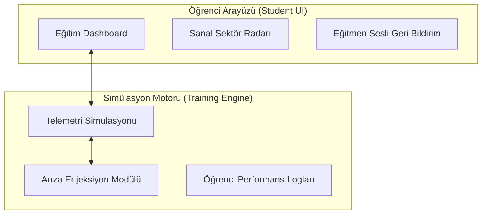

# 🎓 SUNGUR Eğitim Simülatörü `v3.0-Akademi`

[](https://github.com/arch-yunus/uav-mission-control)
[](https://github.com/arch-yunus/uav-mission-control)

> **"Pratikte dökülen ter, sahada dökülecek kanı engeller."**

**SUNGUR Eğitim Simülatörü**'ne hoş geldiniz. Bu arayüz, İHA pilot adaylarının saha operasyonlarına çıkmadan önce temel uçuş dinamiklerini, sürü yönetimini ve acil durum prosedürlerini (motor arızası, sinyal kaybı vb.) risksiz bir ortamda deneyimlemeleri için tasarlanmıştır.

---

## 🎯 Eğitim Odakları (Ders Modülleri)

Sistem, öğrenme eğrisini kademeli olarak artıracak şekilde yapılandırılmıştır:

| Modül | Teknik Odak | Simülasyon Çıktısı |
| :--- | :--- | :--- |
| **İHA-1: Temel Uçuş** | Sanal Kalkış ve İniş | Temel telemetri okuryazarlığı ve stabilizasyon. |
| **İHA-2: Aletli Uçuş** | Görüş Mesafesi Dışı (BVLOS) | Sadece sanal ufuk (Gyro) ve radar ile uçuş pratiği. |
| **İHA-3: Sürü Yönetimi** | Çoklu Ünite Senkronizasyonu | Lider-Takipçi protokollerinin idaresi. |

---

## 🛠️ Simülasyon Çekirdeği (Engine)

Simülatörün kalbi, uçuş dinamiklerini ve acil durum senaryolarını eğitmene/öğrenciye sunan **Training Engine v3.0** motorudur.



### 🧠 Arıza Enjeksiyon Sistemi (Eğitmen Modu)
Eğitmenler, öğrencinin reflekslerini ölçmek için sisteme anlık hatalar enjekte edebilir:
- **Motor Arızası (Kill Switch)**: İrtifa kaybı simüle edilir, öğrenciden acil iniş prosedürleri (Süzülme/Otorotasyon) beklenir.
- **Sinyal Gürültüsü**: Sinyal zayıflığı (RSSI düşüşü) simüle edilerek RTH (Eve Dönüş) karar mekanizması test edilir.

---

## ⚙️ Standart Eğitim Prosedürleri (SOP)

Her kursiyer aşağıdaki aşamaları sırasıyla tamamlamak zorundadır:

1.  **Ders 1 (Sanal Kalkış):** Telemetri verilerinin stabilizasyonunun teyidi ve kontrollü irtifa kazanımı.
2.  **Ders 2 (Sanal İniş):** Rüzgar faktörlerinin simüle edildiği ortamda hedefe yumuşak iniş.
3.  **Ders 3 (Eve Dönüş Pratiği):** Oryantasyon kaybı anında otonom dönüş sistemlerinin devralınması.
4.  **Acil Durum (Arıza):** Eğitmen tarafından tetiklenen motor arızasına saniyeler içinde doğru tepkinin verilmesi.

---

## 📂 Dosya ve Klasör Yapısı

```text
uav-mission-control/
├── 📁 01_theory/          # Teorik eğitim notları ve checklistler
├── 📁 02_simulation/      # Aktif uçuş senaryoları
├── 📁 03_evaluation/      # Öğrenci performans raporları
├── 📁 src/
│   ├── ⚙️ engine/         # Simülasyon Çekirdeği (app.js)
│   └── 🎨 styles/         # CSS Arayüz Tasarımı (style.css)
└── 📄 index.html          # Eğitim Simülatörü Giriş Kapısı
```

---

## 🚀 Hızlı Başlangıç

SUNGUR Eğitim Simülatörünü yerel makinenizde başlatmak için:

```bash
# Depoyu klonlayın
git clone https://github.com/arch-yunus/uav-mission-control.git

# Proje dizinine girin
cd uav-mission-control

# Yerel sunucuyu başlatın
python3 -m http.server 8000
```
Tarayıcınızdan `localhost:8000` adresine giderek eğitime başlayabilirsiniz.

---

**arch-yunus tarafından ⚔️ ile geliştirilmiştir.**
