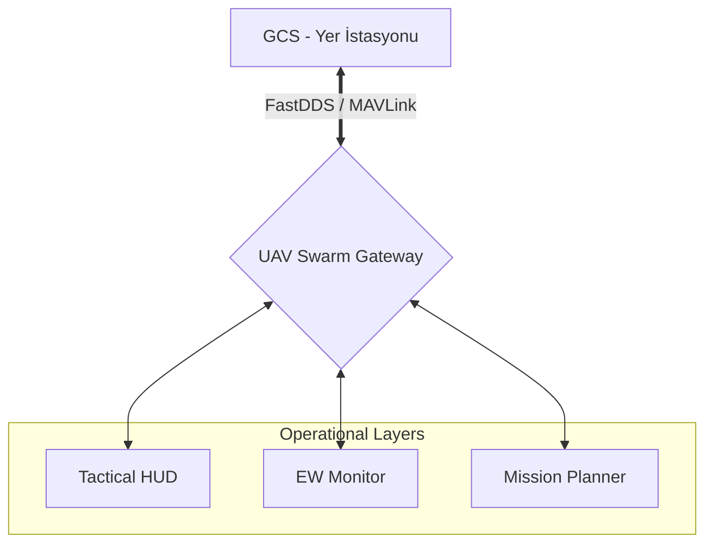

# 🦅 UAV Mission Control: ARGUS Tactical Interface `v2.0-Sovereign`

[](https://github.com/arch-yunus/uav-mission-control)
[](https://www.eprosima.com/)
[](https://github.com/arch-yunus/uav-mission-control)

> **"Göklerin otonom hakimi, stratejik üstünlüğün kalbi."**
> ARGUS Misyon Kontrol Sistemi, merkeziyetsiz sürü yönetimi ve siber-asabiyet temelli otonomi için tasarlanmış uçtan uca bir taktik arayüzdür.

---

## 🏛️ Stratejik Vizyon
**ARGUS Protokolü**, sadece bir kontrol yazılımı değil; GPS'in engellendiği ve yoğun elektronik harp uygulanan sahalarda bile teknik ve zihinsel disiplini (*Siber-Asabiyet*) birleştiren bir komuta merkezidir.

### 🧩 Temel Yetenekler
1. **Düşük Gecikmeli Telemetri**: 50ms altı veri döngüsü.
2. **Elektronik Harp Kalkanı**: Karıştırma ve yanıltma tespiti (Jamming/Spoofing).
3. **Sürü Zekâsı**: Çoklu İHA koordinasyonu ve görev paylaşımı.
4. **Premium HUD**: Glassmorphism estetiği ile yüksek durumsal farkındalık.

---

## 🛠️ Teknik Mimari



---

## 📂 Depo Yapısı

```text
uav-mission-control/
├── 📁 src/                # Uygulama Mantığı
│   ├── 🧩 components/     # UI Bileşenleri (Harita, Telemetri)
│   ├── ⚙️ engine/         # Simülasyon & Veri İşleme
│   └── 🎨 styles/         # Premium Tasarım Sistemi
├── 📁 assets/             # Görsel Varlıklar & Bannerlar
├── 📁 docs/               # Teknik Spesifikasyonlar
└── 📄 README.md           # Sovereign Giriş Kapısı
```

---

## 🚀 Hızlı Başlangıç

Sistemi yerel ortamda çalıştırmak için:

```bash
git clone https://github.com/arch-yunus/uav-mission-control.git
cd uav-mission-control
npm install
npm run dev
```

---

## 🤝 Katkı ve Standartlar
ARGUS, en yüksek mühendislik standartlarına (MIL-STD) uyum sağlar. Kritik güncellemeler ve güvenlik yamaları için ana branch'i takip edin.

**Developed with ⚔️ by arch-yunus.**
