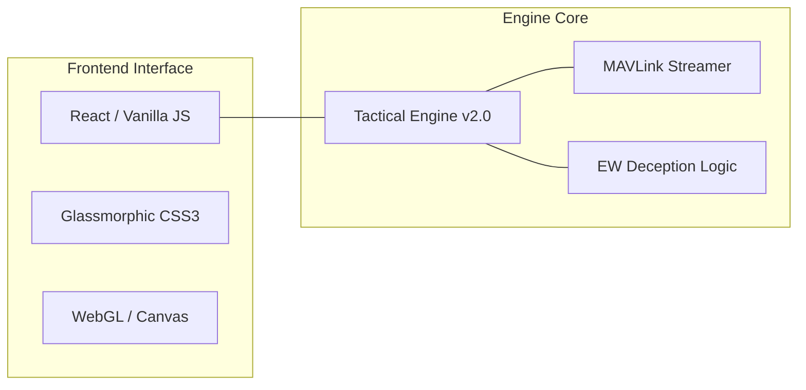

# 🦅 ARGUS Mission Control: Tactical Command HUD `v2.5-Omega`

[](https://github.com/arch-yunus/uav-mission-control)
[](https://github.com/arch-yunus/uav-mission-control)
[](https://github.com/arch-yunus/uav-mission-control)

> **"Visibility is the first step of dominance. Synchronization is the second."**

Welcome to the **ARGUS Tactical Hub**—the ultimate command and control interface for high-performance UAV operations. Designed for low-latency telemetry visualization, multi-swarm orchestration, and real-time electronic warfare monitoring.

---

## 🛰️ The HUD Philosophy: *Siber-Asabiyet*

The ARGUS HUD is not just a dashboard; it is a cognitive extension of the mission commander. Built with **Advanced Glassmorphism** and **Real-Time Simulation Engines**, it provides a distraction-free, high-fidelity environment for executing complex aerial maneuvers in hostile territories.

### 💎 Core Tactical Features

| Feature | Description | Tactical Edge |
| :--- | :--- | :--- |
| **Omni-Telemetry** | Precision Altitude, Velocity, and Heading. | Total Spatial Awareness |
| **Radar Overlay** | Dynamic scanlines and proximity detection. | Threat Mitigation |
| **EW Shield Monitor** | Real-time jamming and spoofing alerts. | Electronic Resilience |
| **Emergency Protocols** | One-tap Kill Switch and RTH sequences. | Asset Safety |

---

## 🛠️ Integrated Tech Stack



---

## 📂 Command Structure

```bash
uav-mission-control/
├── src/
│   ├── engine/         # Tactical Engine Logic (app.js)
│   ├── styles/         # Premium Design System (style.css)
│   └── components/     # Specialized UI Modules
├── public/             # Tactical Assets & Icons
├── docs/               # Manifestos & technical Specs
└── index.html          # The Command Gateway
```

---

## 🚀 Deployment Instructions

```bash
# Clone the tactical gateway
git clone git@github.com:arch-yunus/uav-mission-control.git

# Initialize the environment
cd uav-mission-control
python3 -m http.server 8000
```

---

**Developed with ⚔️ by arch-yunus.**
